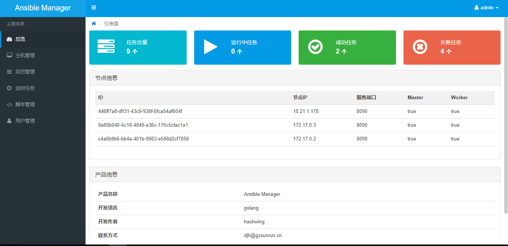
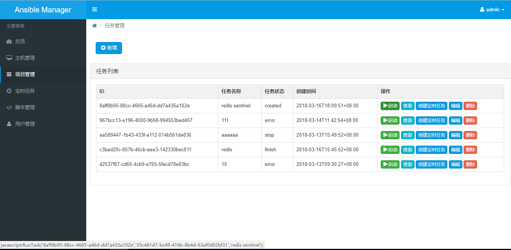
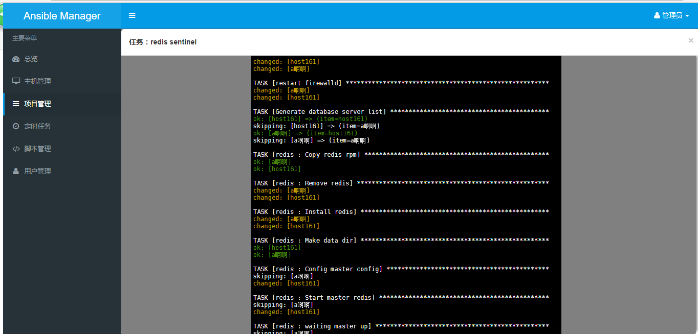

# ansible-manager [](https://travis-ci.org/gzsunrun/ansible-manager)
ansible-manager 实现的是类似ansible ui 的功能，让你的playbook脚本可视化，让你更方便管理你的playbook脚本,让部署更简单快捷。

## 预览







## 特性

- 脚本管理
- 可视化配置
- 任务运行实时输出
- 定时任务
- 可单机，可分布式


## 文档

[安装说明](./Install.md)

## AMfile

```yaml
- name: demo #脚本名字
  version: "2.25" #脚本版本
  desc: "test demo" #脚本描述
  inventory: "demo/inventory" #inventory文件路径
  am_dir: "_AM/demo" #生成模板路径
  vars_dir: "demo/vars" #变量文件路径
  index: "demo/demo.yml" #执行入口文件
  
```

## vars 变量是空数组特殊注释

```yaml
abc:
  ddd: 123
  c: []
    #@- d: 1
    #@  e: 2

```